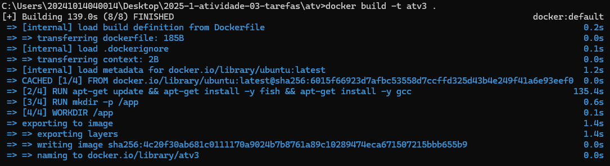
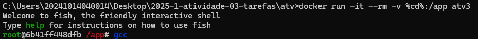
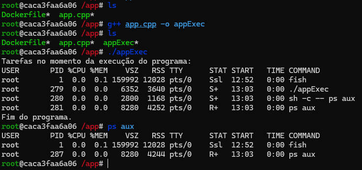

# Tarefas
### Nicollas Matheus Prado Pinheiro - 19/05/2025

## Objetivo
Com a utilização de docker, terminal linux e conhecimentos adquiridos em aula sobre tarefas essa atividade propõe a criação de um container com uma imagem linux para executar uma nova tarefa (um código c++). Dessa forma, colocando em prática tudo que foi estudade até o dia atual.

## Preparação do ambiente

### Criação da imagem docker
Com o comando FROM eu defini o sistema operacional, no caso ubuntu na última versão LTS, a partir disso, executei comandos apt-get do mesmo para atualizar o sistema (apt-get update), instalar o terminal fish e instalar o compilador gcc. Além disso, criei um diretório no container chamado app (mkdir -p /app) e defini ele como o diretório de trabalho no build e então defini a execução do terminal fish como comando de inicialização (CMD ["fish"]).

```DOCKER
FROM ubuntu:latest

RUN apt-get update && apt-get install -y fish && apt-get install -y g++

RUN mkdir -p /app

WORKDIR /app

CMD ["fish"]
```

### Build da imagem
Com o comando "docker build -t atv3 ." eu falei pro docker realizar build do arquivo Dockerfile que está na pasta atual ( . ) e lhe dar o nome, ou tag, "atv3" com o comando "-t atv3".



### Criação e execução de um container com a imagem criada
Com o comando docker run eu falei pro docker criar um container e executa-lo, além disso, torna-lo interativo (-i), criar um terminal para eu interagir (-t), excluir o container ao finalizar a execução (--rm), vinculei o diretório "/app" do meu computador com o container (-v %cd%:/app) e para finalizar defini a imagem à ser utilizada (atv3).



## Criação de tarefas
Aqui eu compilei, dentro do container, o código c++ que está no meu computador (g++ app.cpp -o appExec) e o executei dentro do container (./appExec).

No retorno do programa é possível perceber o "appExec" como uma tarefa que está em estado de "S+", onde "S representa Sleeping" e "+ representa que a execução é em primeiro plano", nesse caso o motivo dele estar sleeping é por que foi executado o comando "ps aux", que justamente retorna esses dados, no meio do código e ele nesse momento exato estava esperando o retorno do comando. Além disso, é possível identificar o seu identificador único (PID) que é 279, a quantidade de memória RAM alocada (RSS) que é 3640KB e entre outras informações.



### Código utilizado:
```CPP
#include <iostream>
#include <cstdlib>

int main(){
    int i = 0;
    while (i < 100000){
        if(i == 1){
            std::cout << "Tarefas no momento da execução do programa:" << std::endl;

             /* Momento em que ocorre a interrupção e a tarefa é posta em espera (sleeping) aguardando o retorno para voltar a atividade. */
            system("ps aux");
        }

        i++;
    }

    std::cout << "Fim do programa." << std::endl;
    return 0;
}
```

## Conclusão
Após terminar a atividade eu adquiri mais conhecimento com docker, aprendendo flags de build/execução e comandos Dockerfile, e aprendi a identificar processos com o comando "ps aux" no linux.